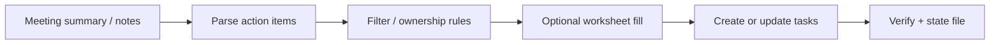

# Kinetic Bridge Ops

Ops automation monorepo: turn operational signals (meetings, task changes, inbox-adjacent events) into **structured actions**, alerts, and repo/lifecycle workflows.

Framed for **data / AI workflow engineering**—extraction, gating, idempotent updates, and runnable local services—not a grab-bag of scripts.

**Repo:** https://github.com/blakeallard/kinetic-bridge-ops

## What this monorepo contains

| Package | Role |
| --- | --- |
| `meeting-actions/` | Meeting notes / summaries → parsed action items → task create/update pipeline (optional visualizer events) |
| `meeting-actions-zoho-v2/` | v2 pipeline + Deluge/Flow samples and stage evidence |
| `meeting-transcriber/` | Transcription helpers feeding the meeting pipeline |
| `zoho-poller/` | Poll task systems → local workspaces / digests |
| `zoho-projects-cliq-alerts/` | Status-change → chat alert path |
| `zoho-task-repo-lifecycle/` | Task → git repo scaffold / lifecycle automation |

## Architecture (meeting path)



Other packages are sibling ops loops (poll → act → notify) with the same discipline: local runnable copies, explicit dry-run where supported, and Git as source of truth.

## Key engineering problems

| Problem | Approach |
| --- | --- |
| Unstructured meeting text | LLM/assisted parse → structured task candidates |
| Duplicate task spam | Local processed-state + title/dedupe keys |
| Fragile one-off scripts | Packaged services with logs, cron/LaunchAgent entrypoints |
| Portfolio / git noise | Consolidated former standalone repos into this monorepo |

## Current status

**Honest state:** packages are **live local automations** (LaunchAgents/cron on the workstation) with uneven cloud deploy maturity. Meeting-actions has Railway-oriented files; treat cloud deploy as optional.

Canonical GitHub home is this repo. Standalone GitHub remotes for the old package names were removed during portfolio consolidation.

## Related products

- [`zoho-docs-index`](https://github.com/blakeallard/zoho-docs-index) — local RAG over product docs
- [`workflow-visualizer`](https://github.com/blakeallard/workflow-visualizer) — live workflow event UI
- [`kinetic-bridge-qts`](https://github.com/blakeallard/kinetic-bridge-qts) — quote / pricing product
- [`kinetic-bridge-email-intel`](https://github.com/blakeallard/kinetic-bridge-email-intel) — email intelligence product

## Local sync

Live LaunchAgent/cron trees live under `~/bevco/automations/`. Push into this monorepo with:

```bash
~/bevco/automations/sync_ops_monorepo.sh
```

Do not `git push` from the old standalone package directories—use the sync script.
